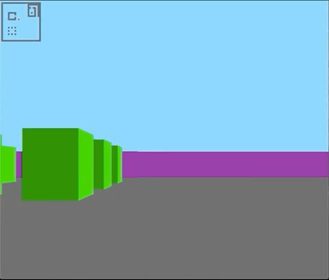
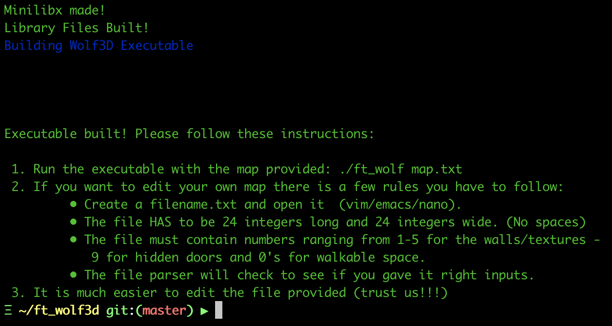
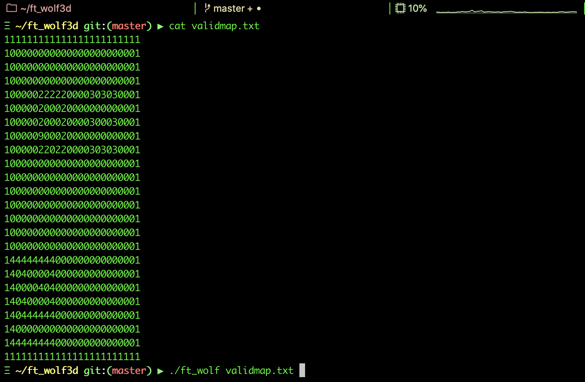
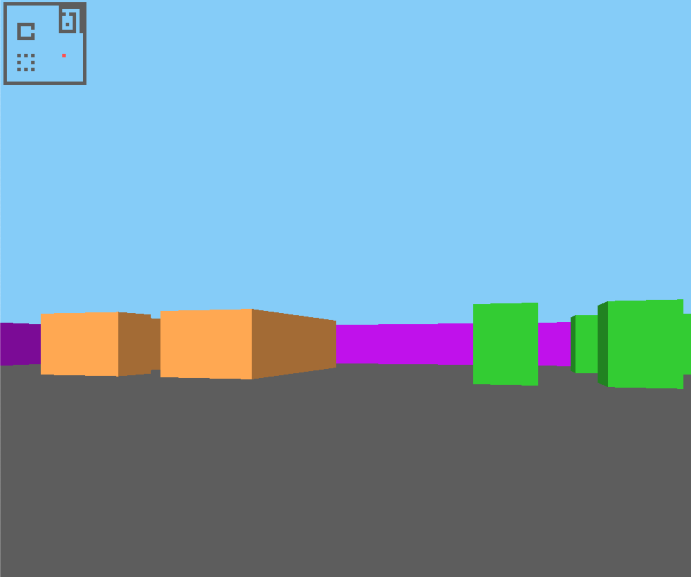

<p align="center">
  <div align="center">
   <br>
  </div>
</p>

# Wolf3d

Wolf3d is a recreation of the gaming engine used in the game Wolfenstein3D that implements a ray-casting algorithm.

Features:

- Full directional movement.
- Wall collision detection.
- Modular map creation.

Additional features:

- Music.
- Colors.
- Mini-map.
- Secret door.

Per the project, all of our functions must begin with ```ft_``` for, _Forty-Two_.

**Project Document:**
[Wolf3d.pdf](https://github.com/elloimbrandon/ft_wolf3d/blob/master/docs/wolf3d.en.pdf)

All functions were written according to 42's coding standard,
[the Norm](https://github.com/elloimbrandon/ft_wolf3d/blob/master/docs/norme.en.pdf).


## Installation

Download the repository by copying and pasting the commands below.

```bash
git clone https://github.com/elloimbrandon/ft_wolf3d.git

```

You can compile the library and executable using the Makefile:

Command       |  Action
:-------------|:-------------
`make`        | Compile the library.
`make clean`  | Remove object files.
`make fclean` | Remove object files and the library.
`make re`     | Re-compile the library.



## Usage

After compilation, run executable with valid map file.

```bash
./ft_wolf validmap.txt
```



Controls       |  Action
:-------------|:-------------
`w`           | Move forward.
`s`           | Move back.
`d`           | Move right.
`a`           | Move left.
`esc`         | exit.

